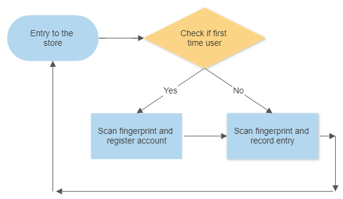
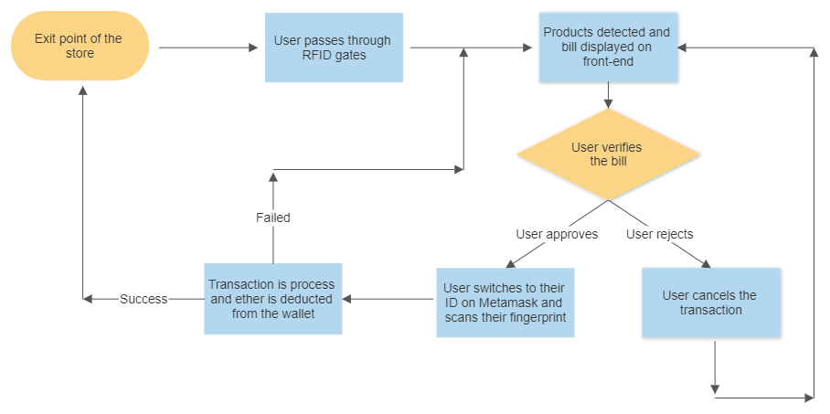
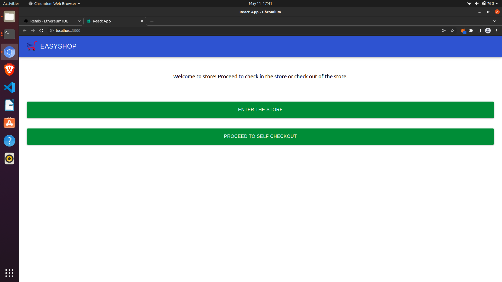
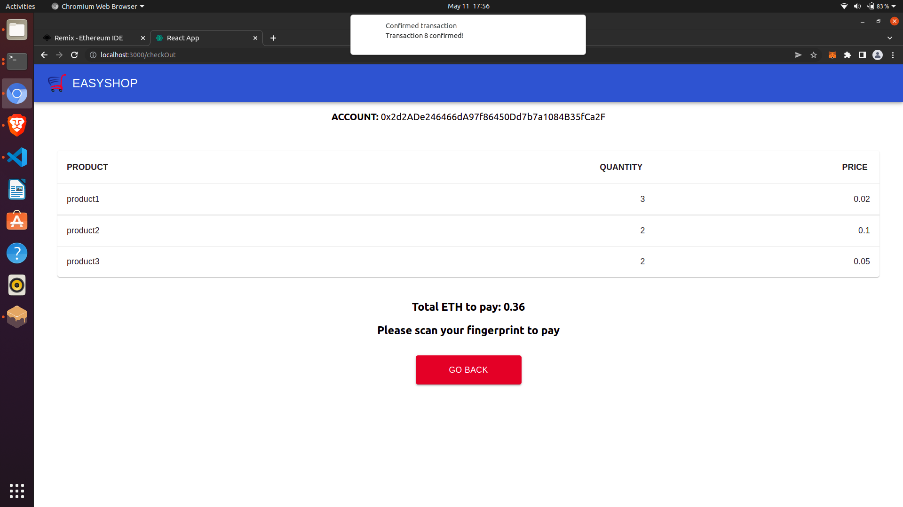
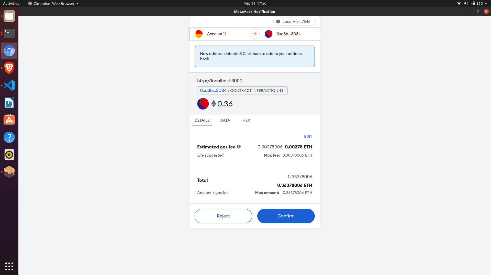
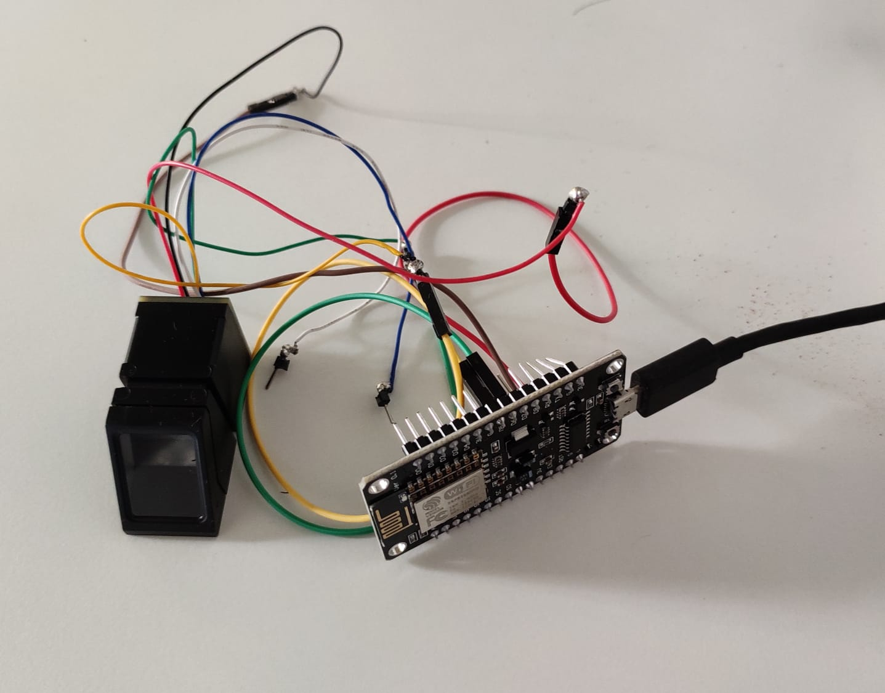
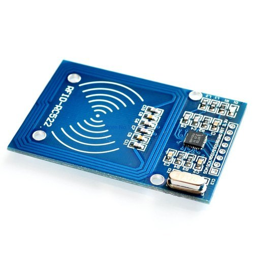
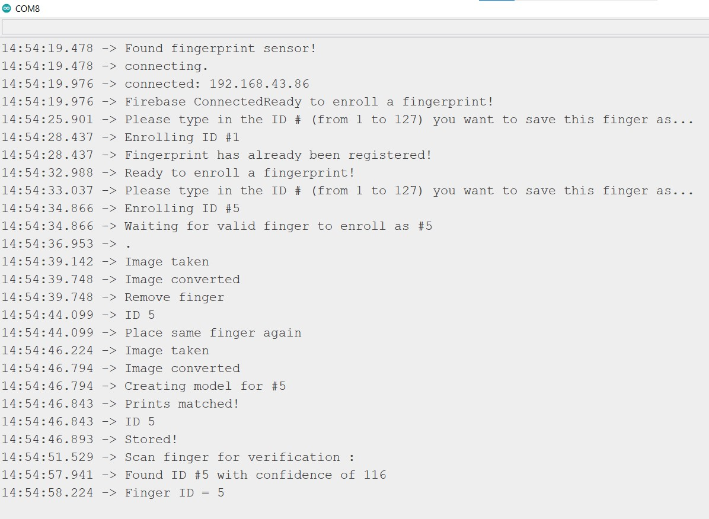

# Self-Checkout System

## Motivation

Many conventional shops have complex and tedious billing process which increases the waiting time for the customers. Long queues at billing counters and slow and manual billing process are some of the typical problems which affects the customer satisfaction. This problem multiplies ten folds in peak traffic leading to customers waiting for hours at billing counter for their turn.

In addition, the shop usually stores some of the personal details like name, phone number and address and use them to give rewards and for personalized advertisements. Sometimes, the customers are forced to give such details. They have no choice and end up giving such details against their will.

Moreover, in the last few years, due to the Covid-19 pandemic and the increase in social distancing norms, the demand for all things being contact-less and automated has been increasing.

Despite all this problems, conventional store checkout systems continue to require a cashier to assist the customer. Even if some form of self billing is implemented, the system is usually quite confusing for the first time, even for regular customers and they end up needing assistance. In addition, the customer as well as the shop owner are cautious about the transactions taking place. Not to forget, the shop owner will always have concerns about the safety of their goods.

To address these concerns, we came up with an automated system with a checkout process that protects user privacy and is completely contact-less. The system reduces the waiting time in queues as the process is faster and prevents theft by detecting items which are concealed. In addition, the transactions take place on blockchain and the transaction history is stored on blockchain ledger making them immutable. Our system also adds a layer of security on top of blockchain using fingerprint sensor to prevent unlawful transactions.

## What it Does?

The whole system is broadly divided into two parts: Check-in and Check-out.

### Check-in

A user first enters the store. At the entry check point, he has two options, either to register or to enter the store.

If the user does not have a registered account, they will have to first register their account with their fingerprint. The system registers the account only if the account is not already registered.

If the user has a registered account, they can check in to the store. For check in, the user just needs to scan their fingerprint. The system automatically detects their account and registers the user's entry. If any corresponding account is not found, the system alerts the user.

     
    <em>Check-in flowchart</em>

### Check-out

The user has to login to their blockchain address on the Metamask browser extension. Once the user has selected their products, they pass through gates containing RFID reader (present in many stores as an anti-theft device), the reader detects the particular tags which the user has selected and automatically calculates and display the bill on the front-end. Once the user verifies the bill and is ready to pay, they are asked to scan their finger again. If the finger is verified against the User-ID that the current user is associated to, the transaction is confirmed and processed. Once the transaction is completed, the user can see the amount deducted in their Metamask wallet. The user is directed back to the home page. The user can leave their account details in the store if they wish as no transaction will be processed without authenticated fingerprints. They can also choose to enable two factor authentication which means that their wallet login details will not be saved in the store's system and the user will have to enter their private key every time they want to make a transaction.

     
    <em>Check-out flowchart</em>

## System Architecture

### Components

The entire system has 4 broad components.

<ul>
    <li><b>The hardware:</b>
        <ul>
            <li><b>Fingerprint sensor :</b> Used for providing additional layer of security on top of blockchain to verify the users.</li>
            <li><b>RFID reader and tags :</b> The reader is installed at the shop's checkout gate to detect the tags. Each tag represents a product.</li>
        </ul>
    </li>
    <li><b>Firebase Real Time Database :</b> Used as a shared memory medium to establish communication between sensors and the webapp.</li>
    <li><b>Ethereum Blockchain :</b> Each user will have a blockchain address for payment. The payment is done through MetaMask which is a wallet provider.</li>
    <li><b>Web application :</b> The front-end web application provides interface for the customers.</li>
</ul>

### Components description

#### Fingerprint sensor

In our project, we are using the R307 fingerprint sensor. This along with the Adafruit Fingerprint library, gave us easy functions to record and store fingerprints of users and verify fingerprints against the database.

To record a new fingerprint into the database, we have to scan our finger twice as per the prompts from the system. If the prints match, the fingerprint is added to the database. The system stores the fingerprint against the particular user's ID.

Upon registration, the fingerprint ID is pushed to the Firebase database which is then picked up and used by the website.

The module also gives a convenient and fast search method that goes through the all the stored fingerprints and returns the most likely one and also gives us a confidence level in its prediction. This function is used in the verification process, where the person scans their finger and the closest match is obtained. The ID of the closest match is pushed to Firebase and again used by the front-end. The finger is scanned up to five times until an acceptable image of the finger is taken.

#### RFID readers

RFID is quite a ubiquitous technology used for many different applications. RFID technology is cheap and power efficient which makes it suitable for our application as well. We used the RFID-RC522 reader and tags whose range extends to about 1-2 cm. This particular restriction makes it difficult for us to prevent shoplifting because if the range was higher, we planned to make every customer walk through gates containing RFID reader that can detect all the tags both concealed and non-concealed. This was even supposed to make check-out easier and faster. With this limited range RFID tags, each of which correspond to a particular product, have to be placed at the reader like any other store.

Each RFID tag stores some particular data and has a unique ID called a UID. Our plan was to hard code each UID against a particular product in the software and each time a UID is read, add that particular product to the bill of the customer.

We also used an ESP8266 NodeMCU board which has a WiFi module to help us transfer data to the Firebase database. It connects to a Mobile Hotspot and also allows us to use Firebase modules to push and pull from the database.

#### Firebase real time database

Firebase real-time database is used to establish communication between web-app and the sensors using shared memory. Whenever a user scan's a fingerprint, it will be put on Firebase for the web-app to fetch and process accordingly.

#### Web application

The web application is an interface for the user to navigate and use the system conveniently. The web application is developed using React.Js and works synchronously with smart contract and sensors. There are two main components in the web-app namely check-in and check-out. In check-in, the user can either register or enter the store. If the user is registered, they cannot register again. Similarly, the user cannot proceed to checkin without registration. In check-out, all the products scanned by RFID reader will be rendered. The user can check the items and proceed to pay the amount in Ethereum using MetaMask wallet provider. In order to pay, the user has to connect their account and scan the fingerprint. Fingerprint based authentication is enabled in registration, check-in and check-out to prevent illegal transactions.

#### Ethereum blockchain

This is the most important aspect of the project in terms of maintaining user privacy. We are using Ethereum blockchain to create smart contracts. All the registered accounts are stored on blockchain ledger along with their hashed fingerprints. The accounts present in the ledger can enter the store just by scanning their fingerprint. Similarly, these accounts can pay the bill and checkout of the store using just their fingerprints after connecting their wallet. The blockchain ledger also stores all the transaction history and the available products.

## Features

### Privacy Features

<ul>
  <li><b>Customer Privacy:</b> A store implementing this billing system would not need to collect other details about the user to offer any schemes and deals. The store can use either fingerprint or blockchain address of the user both of which are unique. The fingerprint of the user will be stored in a hashed manner to prevent unlawful accesses. Blockchain wallet address is a public address and designed to be visible to the world. Using such a system, we do not need to collect private user information like phone number, address or even name.</li>
</ul>

### Security Features

<ul>
<li><b>For the store owner:</b> Such a check out model will prevent any form of shoplifting as the RFID gates will be able to detect any and all tags (concealed or not) and add it to the bill of the customer. In a real world implementation, we expect there will be gates which will allow customer to pass only after the bill is paid.</li>
<li><b>For the customers:</b> The introduction of two factor authentication (fingerprint + private key of blockchain wallet) greatly reduce the possibility for identity theft and fradulent transactions.</li>
</ul>

## Application

Some screenshots of the application are given below:

     
    <em>Homepage</em>

     
    <em>Generated Invoice</em>

     
    <em>Payment</em>

     
    <em>Fingerprint sensor</em>

     
    <em>Short range RFID reader</em>

     
    <em>Serial monitor output</em>

## Future Work

The implemented prototype of the application can be scaled to add many more features. Currently, at checkout, the amount is being shown in Ethereum. Since many people are not aware of Ethereum, the amount can be converted into other currency units and displayed along with Ethereum.

The functionality of mailing the invoice to the customer can also be implemented. After the user pays the bill, the system asks the user if they want the invoice mailed. After this, the user has to put their email id and press the "Mail Invoice" button. For this feature, we don't store the email id of the user but instead ask the user to enter an ID each time to maintain user anonymity.

Another functionality of displaying the store stocks, the products purchased along with other critical statistics to the shop owner can also be implemented. The owner can use these statistics to purchase relevant products.

This system can be adapted to use UPI for payments as well in places with low awareness about blockchain.
